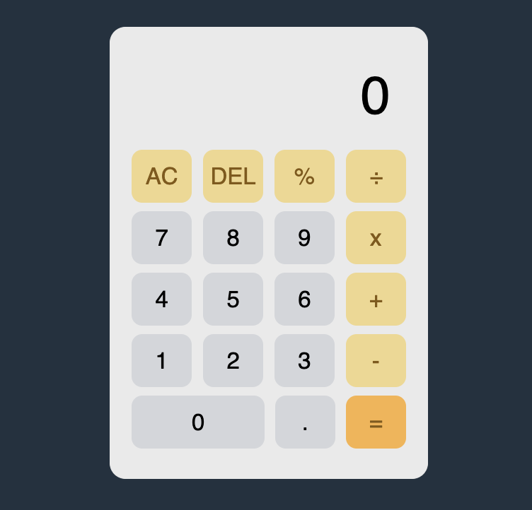

# The Odin Project Calculator 

  

## Overview

Welcome to the TOP (The Odin Project) Calculator! It's your go-to, web-based buddy for quick and snappy arithmetic calculations. Sporting a neat and tidy interface, this calculator makes crunching numbers a breeze with its easy-to-use buttons for all the basic math operations like adding, subtracting, multiplying, and dividing. Plus, it's got some cool extra features like 'AC' to clear everything in a jiffy, 'DEL' for when you just need to erase the last digit, and '%' for those handy percentage calculations. Happy calculating!

## Usage
Access the calculator through [this link](https://naiminafis.github.io/calculator/) . On the screen, you'll see your input and results. Use:

- Number keys for digits.
- '+' for addition, '-' for subtraction, '*' for multiplication, and '/' for division.
- 'AC' to clear everything, 'DEL' to remove the last digit, '%' to calculate percentages.
- '=' to get the result.
- Example: To calculate 20% of 50, enter 50 * 20 % =.

## Future Improvement
As the 5th project in the TOP Foundation course, this calculator marks a major milestone – and I've ticked all the essential boxes to make it a success. But, hey, there's always room to grow and make things even better, right? I'm thinking about giving the user interface a bit of a facelift and tweaking the logic under the hood. My goal? To make your experience smoother and the calculator's brain sharper. Let's make this tool not just useful but super intuitive and a joy to use

## Contributing
Contributors are always welcome to make contributions to this project and help improve it. If you'd like to contribute or work on available issues, feel free to do so. Let's collaborate and make this calculator even better!

## Happy Coding!
I hope you find this TOP Calculator useful and enjoy using it for your calculations. If you have any questions or suggestions, please don't hesitate to reach out to [Naimi Nafis](https://github.com/NaimiNafis).